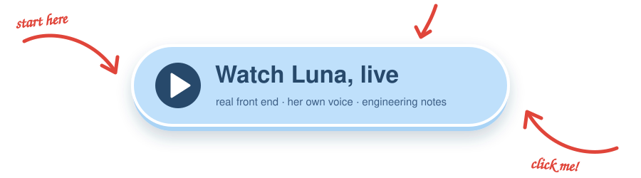
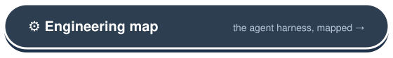

<div align="center">


**An experimental embodied-agent project.**

Luna is where I — Alan, an agent engineer — try today's agent-harness ideas on something that has to
live with a person: memory that consolidates while she "sleeps", initiative that knows when to stay
quiet, tools behind safety rails, and a body and a voice to say it with.

<a href="https://alan-yu-2077.github.io/Luna/"></a>

<a href="https://alan-yu-2077.github.io/Luna/engineering/"></a>

**English** · [简体中文](README.zh-CN.md)

[](LICENSE)
[](https://bun.sh)
[](tsconfig.json)

</div>

---

## ▶ The replay

Fourteen scenes from a week with her, in English or in Chinese, played through her **real front end and
rendering engine** with her own pre-rendered voice — the lines are typed for you; you press ➤.

After every scene, **"view what's going on in code"** freezes the page and opens a stack of engineering
notes: the question a visitor would ask ("how does she know it's raining?") answered down to the prompt
block, the tool, the safety gate and the source file — every snippet pinned to a commit and checked
against the repository by a test. Best on a computer.

The replay is the showcase because Luna is not a distributed product: she was built around one instance
on one machine, and a live model for every visitor would cost more than it shows.

## 🧩 What's inside

| | |
| --- | --- |
| 🧠 **Memory that sleeps on it** | A verbatim working window, salience-scored turns and structured long-lived facts in one SQLite file. An offline **dream cycle** rates the day, rewrites the facts, writes her diary and distills reusable skills. Recall blends meaning, keywords and recency, with a relevance floor so an old memory that matters is never buried. |
| 🌱 **Initiative with brakes** | She can start a conversation — a silence ladder, a music-moment wake, a second thought — behind deterministic rails: a surface tool (a shell command, an edit) is refused in a waking until she has said what she is about to do. |
| 🛠 **Tools, gated** | Web search and SSRF-guarded page reading, weather, time, music (what's playing, his library, lyrics), and a code agent (grep, symbols, edits, tests, typecheck) that cannot touch secrets or the code that grades it. |
| 🗣 **A body and a voice** | Speech is a tool call: each bubble carries an expression that drives a Live2D face, voiced by a GPT-SoVITS model, the face changing as each line begins. |
| 🔌 **One contract** | A single Zod-typed WebSocket protocol shared by server and web — tool calls and messages stream as they happen; a wire change missing on either side is a compile error. |

## 🏗 How it fits together

<div align="center">


<sub>The model is the one part nobody here wrote. Everything else is a decision about what it may see,
what it may do, and what survives to the next call.</sub>

</div>

Five Bun workspace packages with a one-way dependency arrow: [`protocol`](packages/protocol) (the wire
contract), [`server`](packages/server) (the brain — all state and every model call),
[`web`](packages/web) (a thin reactive view, and the replay), [`music-cli`](packages/music-cli) (a
macOS Now-Playing observer) and [`desktop`](packages/desktop) (an Electron shell). The deep dive is
[`ARCHITECTURE.md`](ARCHITECTURE.md); the interactive map is the button above.

## 🎬 Moments from the real app

<table>
  <tr>
    <td width="50%"></td>
    <td width="50%"></td>
  </tr>
  <tr>
    <td align="center"><sub><b>A sense of humour.</b> A running bit, played straight — the mood pill flips to <i>Playful</i>.</sub></td>
    <td align="center"><sub><b>Actual help.</b> Does the grade maths, and gets the emotional register right.</sub></td>
  </tr>
  <tr>
    <td></td>
    <td></td>
  </tr>
  <tr>
    <td align="center"><sub><b>She builds on herself.</b> Saves a skill "for a version of myself I haven't met yet", then uses it.</sub></td>
    <td align="center"><sub><b>She reads her own code</b> to answer how her own skill system works.</sub></td>
  </tr>
</table>

## 📚 Reading the code

Start with [`ARCHITECTURE.md`](ARCHITECTURE.md) for the shape, then
[`docs/history/DEVELOPMENT.md`](docs/history/DEVELOPMENT.md) — 250+ per-version entries, each split into
*Fact* (what changed) and *Inference* (why it mattered), including the versions that were wrong. That
log, not this page, is the honest account of how she was built.

| | |
| --- | --- |
| [`ARCHITECTURE.md`](ARCHITECTURE.md) | Packages, the wire contract, memory, tools, the proactive rails, the replay |
| [`docs/history/DEVELOPMENT.md`](docs/history/DEVELOPMENT.md) | The per-version engineering log |
| [`ROADMAP.md`](ROADMAP.md) | Where things went, by theme |
| [`.env.example`](.env.example) | Every configuration knob, documented |
| [`CONTRIBUTING.md`](CONTRIBUTING.md) | Conventions, tests, workflow |

## 🧪 Running it

This repository is **the engineering, published for reading** — not a product. It was developed
around a single instance on one machine, so there is no promise it runs on yours, and the voice and the
avatar are not part of what is offered for reuse. If you want to try anyway:

<details>
<summary>Build from source (unsupported)</summary>

```sh
git clone https://github.com/Alan-Yu-2077/Luna.git
cd Luna
bun install
cp .env.example .env   # set ANTHROPIC_API_KEY (or a compatible gateway)
bun run dev            # server + web at http://localhost:5173
bun test               # the whole suite
```

The server binds **loopback (`127.0.0.1`)** by default; memory is a local SQLite file and keys stay in
your local config.

</details>

## 📄 License

[MIT](LICENSE), with one carve-out: the vendored **Live2D Cubism Core** runtime
(`packages/web/public/live2dcubismcore.min.js`) is proprietary to Live2D Inc. and governed by its own
license. See [`THIRD_PARTY_LICENSES`](THIRD_PARTY_LICENSES).

## ❤️ Acknowledgements

[GPT-SoVITS](https://github.com/RVC-Boss/GPT-SoVITS) ·
[pixi-live2d-display](https://github.com/guansss/pixi-live2d-display) ·
[Live2D Cubism](https://www.live2d.com/) ·
[Bun](https://bun.sh) · [Electron](https://electronjs.org) ·
weather by [QWeather](https://dev.qweather.com/) & [Open-Meteo](https://open-meteo.com/) ·
search by [Tavily](https://tavily.com/)
