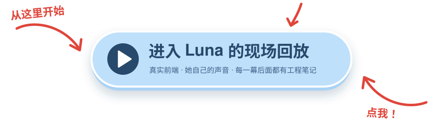

<div align="center">


# Luna

**一个实验性的具身智能 Agent 项目。**

我是 Alan，一名 agent 工程师。Luna 是我拿来试验当下 agent 设计思路的地方，而且试验对象得真的和一个人
一起过日子：睡一觉会整理记忆，知道什么时候该主动、什么时候该闭嘴，工具都关在安全护栏里，还有身体和声音。

<a href="https://alan-yu-2077.github.io/Luna/"></a>

<a href="https://alan-yu-2077.github.io/Luna/engineering/"></a>

[English](README.md) · **简体中文**

[](LICENSE)
[](https://bun.sh)
[](tsconfig.json)

</div>

---

## ▶ 现场回放

十四幕，取自她和我相处的一周，中文、英文两个版本。用的是她**真实的前端和渲染引擎**，声音是她自己的音色，
提前渲染好。台词会替你打好，你只管按 ➤。

每一幕演完，点「看看代码里发生了什么」，页面会冻结，右边浮出一摞工程笔记：从访客最想问的那个问题
（“她怎么知道外面在下雨？”）一路讲到 prompt 里的哪一块、哪个工具、哪道安全闸、哪个源文件。每段代码都钉在
一个提交上，测试会逐字核对它和仓库一致。请用电脑打开。

之所以用回放来展示，是因为 Luna 不是分发给大家用的产品：她围绕一台机器上的一个实例开发，要给每位访客
都跑一个真模型，花的钱远比能展示的多。

## 🧩 里面有什么

| | |
| --- | --- |
| 🧠 **睡一觉会整理的记忆** | 原话工作窗口、按显著性沉淀的对话、结构化长期事实，全在一个 SQLite 文件里。离线的**梦境循环**给一天打分、改写事实、写日记、提炼可复用的技能。召回同时看语义、关键词和新近度，并设了相关性下限，要紧的旧记忆不会被新消息埋掉。 |
| 🌱 **带刹车的主动性** | 她能主动开口：沉默阶梯、换歌时刻、转念一想。背后是确定性的护栏：在她主动醒来的回合里，会动到外界的工具（跑命令、改代码）必须等她先把要做什么说出口才放行。 |
| 🛠 **关在闸门里的工具** | 联网搜索和防 SSRF 的网页读取、天气、时间、音乐（正在放什么、他的曲库、歌词），还有一个代码 agent（grep、查符号、改代码、跑测试、类型检查），碰不到密钥，也改不了给她打分的代码。 |
| 🗣 **身体和声音** | 说话本身是一次 tool call：每个气泡带一个表情，驱动 Live2D 的脸，由 GPT-SoVITS 念出来；表情跟着每一句开口时切换。 |
| 🔌 **一份契约** | server 和 web 共用一份 Zod 类型的 WebSocket 协议，tool call 和消息边发生边流出来；哪一边漏改了协议，编译就过不去。 |

## 🏗 它是怎么拼起来的

<div align="center">


<sub>模型是这里唯一一块不是我写的部分。其余的每一样，都是在决定它能看见什么、能做什么、什么能留到下一次调用。</sub>

</div>

五个 Bun workspace 包，依赖单向：[`protocol`](packages/protocol)（线上协议）、[`server`](packages/server)
（大脑，所有状态和每一次模型调用都在这里）、[`web`](packages/web)（一层薄薄的视图，回放也在这里）、
[`music-cli`](packages/music-cli)（macOS 正在播放的观察器）、[`desktop`](packages/desktop)（Electron 外壳）。
细节见 [`ARCHITECTURE.md`](ARCHITECTURE.md)；可交互的图谱就是上面那颗按钮。

## 🎬 真实 app 里的片段

<table>
  <tr>
    <td width="50%"></td>
    <td width="50%"></td>
  </tr>
  <tr>
    <td align="center"><sub><b>她有幽默感。</b>一本正经地接梗，心情标签切到「俏皮」。</sub></td>
    <td align="center"><sub><b>她真能帮上忙。</b>把分数算清楚，情绪的分寸也拿捏对了。</sub></td>
  </tr>
  <tr>
    <td></td>
    <td></td>
  </tr>
  <tr>
    <td align="center"><sub><b>她会在自己身上长东西。</b>给“还没见过的那个我”存了一个技能，几分钟后就用上了。</sub></td>
    <td align="center"><sub><b>她读得懂自己的代码</b>，用它来回答自己的技能系统是怎么工作的。</sub></td>
  </tr>
</table>

## 📚 怎么读这份代码

先看 [`ARCHITECTURE.md`](ARCHITECTURE.md) 了解整体形状，再看
[`docs/history/DEVELOPMENT.md`](docs/history/DEVELOPMENT.md)：250 多条按版本记录的开发日志，每条分成
*Fact*（改了什么）和 *Inference*（为什么要紧），做错了的版本也都留着。真正诚实地讲清她是怎么搭起来的，是那份日志，不是这一页。

| | |
| --- | --- |
| [`ARCHITECTURE.md`](ARCHITECTURE.md) | 各个包、线上协议、记忆、工具、主动性护栏、回放 |
| [`docs/history/DEVELOPMENT.md`](docs/history/DEVELOPMENT.md) | 逐版本的工程日志 |
| [`ROADMAP.md`](ROADMAP.md) | 按主题回看她走过的路 |
| [`.env.example`](.env.example) | 每一个配置项，都有说明 |
| [`CONTRIBUTING.md`](CONTRIBUTING.md) | 约定、测试、工作流 |

## 🧪 自己跑起来

这个仓库是**公开出来给人读的工程本身**，不是产品。它围绕一台机器上的一个实例开发，不保证能在你的电脑上跑起来；
音色和立绘也不在可复用的范围内。如果你还是想试试：

<details>
<summary>从源码构建（不提供支持）</summary>

```sh
git clone https://github.com/Alan-Yu-2077/Luna.git
cd Luna
bun install
cp .env.example .env   # 填 ANTHROPIC_API_KEY（或兼容的网关）
bun run dev            # server + web，在 http://localhost:5173
bun test               # 全部测试
```

server 默认只监听 **本机回环（`127.0.0.1`）**；记忆是本地的 SQLite 文件，密钥只留在你本地的配置里。

</details>

## 📄 许可证

[MIT](LICENSE)，有一个例外：内置的 **Live2D Cubism Core** 运行时
（`packages/web/public/live2dcubismcore.min.js`）归 Live2D Inc. 所有，受其自有许可证约束。见
[`THIRD_PARTY_LICENSES`](THIRD_PARTY_LICENSES)。

## ❤️ 致谢

[GPT-SoVITS](https://github.com/RVC-Boss/GPT-SoVITS) ·
[pixi-live2d-display](https://github.com/guansss/pixi-live2d-display) ·
[Live2D Cubism](https://www.live2d.com/) ·
[Bun](https://bun.sh) · [Electron](https://electronjs.org) ·
天气来自 [QWeather](https://dev.qweather.com/) 与 [Open-Meteo](https://open-meteo.com/) ·
搜索来自 [Tavily](https://tavily.com/)
